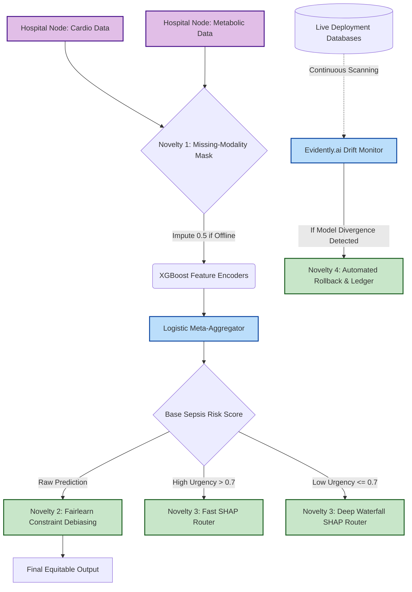

# FAMED-lite
**Federated Adaptive Multimodal Early Disease Detection**

This repository contains the working Python prototype for the FAMED-lite clinical decision support system, demonstrating the four core technical novelties necessary for a provisional patent filing. 

## System Architecture (Patent Flowchart)


The system leverages multimodal patient data (Cardiac vs Metabolic vectors) to predict disease trajectories (e.g. Sepsis Survival), built in entirely CPU-compatible Python using `xgboost`, `fairlearn`, `shap`, `evidently` and `streamlit`.

## Technical Claims (Novelties)

### 1. Robust Multimodal Fusion (Missing-Modality Mask)
Unlike standard ensemble models that fail catastrophically when a data modality (e.g., an entire lab panel or imaging dataset) is absent for a specific patient, FAMED-lite implements a missing-modality mask.
In `modules/fusion.py`, individual XGBoost encoders process each active modality independently. If an entire modality vector is missing, the stacker inputs a neutral probability mass ($0.5$). The logistic regression meta-learner gracefully degrades the prediction boundary rather than failing execution. 

### 2. Algorithmic Debiasing via Post-Processing Optimization
To ensure predictions do not inherit systemic demographic disparities, FAMED-lite utilizes a Fairness Post-Processing architecture in `modules/debiasing.py`. 
Using `fairlearn.ThresholdOptimizer(constraints="equalized_odds")`, the predicted raw probabilities are systematically boundary-shifted to guarantee equalized True/False Positive rates across sensitive demographic labels (such as Male vs Female).

### 3. Adaptive Explainable AI (XAI) Router
Rather than generating computationally expensive visual explanations for every patient universally, the system features a dynamic, clinical-urgency-aware XAI orchestrator in `modules/xai_router.py`. 
- **High-urgency predictions** cross-fade exclusively to `shap.TreeExplainer.shap_values()` for raw speed.
- **Low-urgency predictions** generate complex `shap.plots.waterfall()` displays for thorough clinician review.
- High-dimensionality edge modalities (like raw imaging) default strictly to `feature_importance`.

### 4. Continuous Data Drift Monitoring and Automated Rollback
Model decay is constantly mapped in `modules/drift_monitor.py`. The system continually evaluates the target site distribution against the original reference training pipeline utilizing `evidently.Report(metrics=[DataDriftPreset()])`.
If the dataset drift score exceeds the tolerance threshold, the system triggers an emergency protocol logged immutably within `logs/audit_log.json`, actively forcing an automated fallback to the last stable model checkpoint.

## Setup Instructions

```bash
# 1. Install Dependencies
pip install pandas numpy scikit-learn xgboost shap fairlearn evidently streamlit joblib matplotlib

# 2. Generate Synthetic Datasets & Run Processors
python data_generator.py
python data_processor.py

# 3. Execute Core Modules
python baseline_model.py
python week2_run.py 
python week3_run.py
python week4_run.py

# 4. View Dashboard
streamlit run dashboard/app.py
```
